# Sobre o Projeto 💻:

Projeto do desafio final do módulo 1 do curso de formação para desenvolvedor front end da escola Vai na Web. A proposta do desafio foi para desenvolver um site fictício de pet shop chamado "Fantastika" usando o HTML5 & CSS3 e deixá-lo responsivo também.
 
## 🚀 Tecnologias

Esse projeto foi desenvolvido com as seguintes tecnologias:

-HTML5 & CSS3;

## 🔧 Ferramentas de desenvolvimento

Utilizei o editor de código VSCode para desenvolver o site, e para testar a parte responsiva do site, foi usada uma extensão do Google Chrome chamada Mobile simulator - responsive testing tool, para testar a versão mobile do site para deixá-lo responsivo.

## 🔖 Layout

Você pode visualizar o layout do projeto no adobe através [DESSE LINK](https://xd.adobe.com/view/c20d8ff9-baf0-4a06-b200-3ffde9c66040-975e/screen/af5cc547-c866-4eef-a092-487cd6f6c6aa/specs/?authuser=0).

## 🔖 Projeto Concluído - Versão desktop:

Tentei deixar o projeto o máximo possível igual ao do link do adobe, tanto na versão desktop e mobile do site. Segue abaixo as versões desktop e mobile do site que eu desenvolvi:

## Cabeçalho:

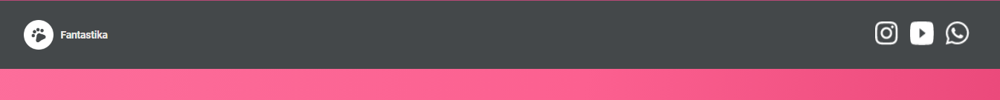

## Seções:

seção 1:

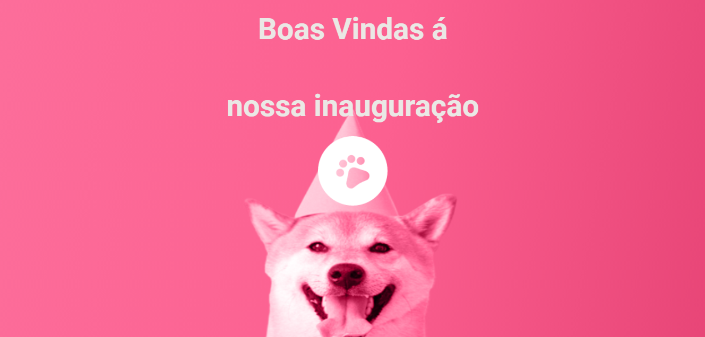

seção 2:

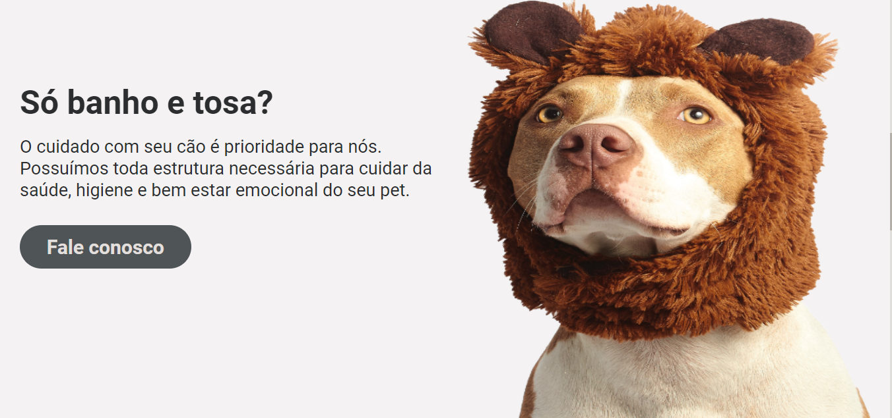

seção 3:

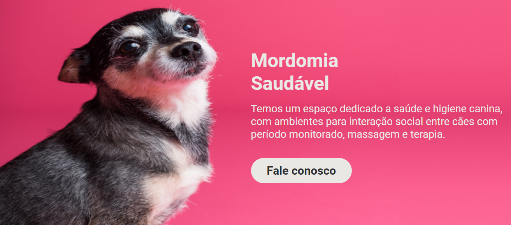

seção 4:

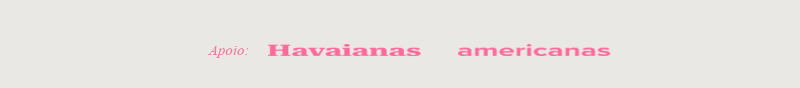

## Footer:

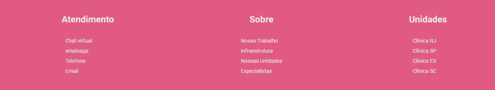

## 🔖 Projeto Concluído - Versão mobile:

## Cabeçalho:

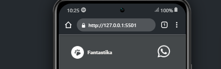

## Seções:

seção 1:

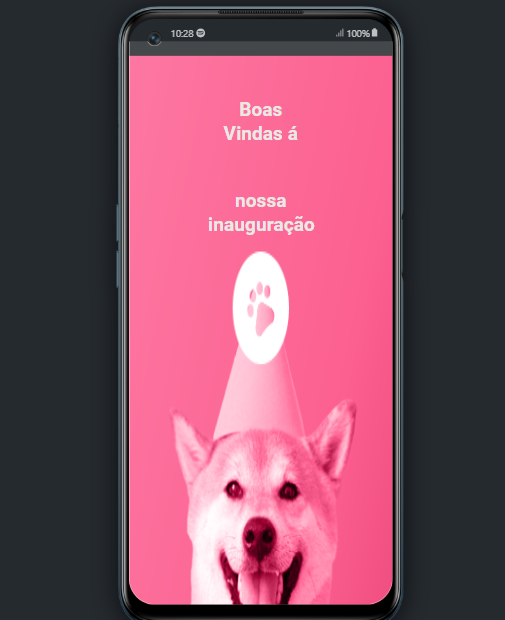

seção 2:

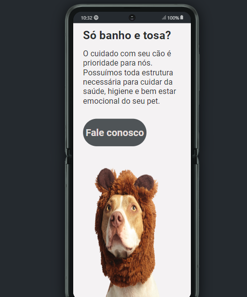

seção 3:

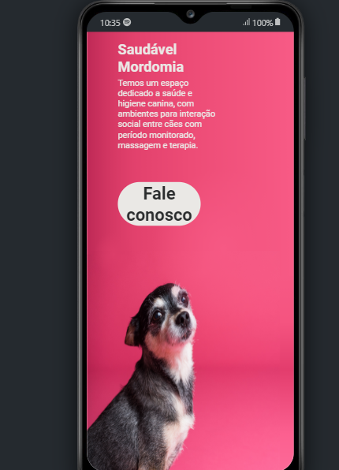

seção 4 e footer:

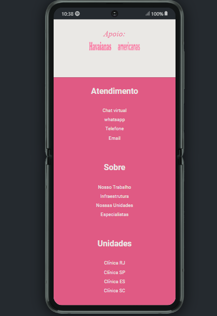

# 👨‍💻 Autor:

Onde me encontrar?

- Entrar em contato comigo:

 https://lsantana95.github.io/RocketLinks/